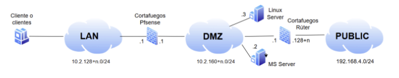
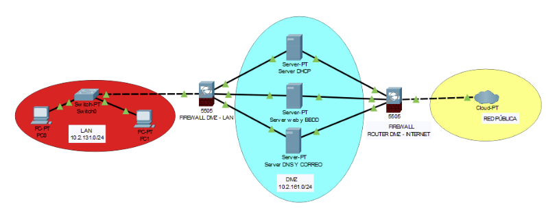

# Anteproyecto

Para el desarrollo del proyecto intermodular, requiere montar una arquitectura física de máquinas, las cuales deben incluir servidores de microsoft o de linux, además de incluir clientes de ambas distribuciones.

La imagen adjuntada, especifica que máquinas y arquitectura debe incluir como mínimo, a partir de estos requisitos, nosotros hemos planteado, seguir la siguiente distribución de servidores y clientes.

## NUESTRO ANTEPROYECTO

Hemos considerado hacer la siguiente distribución:

Servidores Linux:

- SO: Debian 12
- Funciones: Utilizaremos 2 servidores Debian, el primero para WEB y BBDD, el segundo para DNS y CORREO

Servidor Windows:

- SO: Windows Server 2019
- Función: Utilizaremos windows server para el DHCP

Clientes:

- SO: Windows 10 (en duda)
- SO: Linux (2)

Máquinas pfsense

- Función: Proxy (Cortafuegos dmz-Red local)
- Función: Cortafuegos (DMZ - exterior)

### Objetivo del Proyecto: 

Nuestro proyecto intermodular tiene como objetivo el diseño, desarrollo, creación e implementación de una página web de búsqueda de empleo fácil y eficaz. La página web será desplegada sobre la infraestructura de servidores y clientes previamente comentada (configurada), servirá como punto de encuentro entre empleados y empleadores (profesionales de Recursos Humanos - RRHH) que necesitan captar talento.

### Roles de Usuario: 

La plataforma distinguirá entre dos tipos de usuarios:

- Candidato (Empleado): Podrá explorar ofertas de trabajo disponibles, postularse a las que se ajusten a su perfil y gestionar su cuenta.
- Empleador (RRHH): Tendrá la capacidad de crear y publicar ofertas de empleo, buscar perfiles específicos y gestionar las ofertas recibidas.

### Funcionalidades Principales:

- Gestión de Cuentas y Autenticación: Sistema de registro seguro que requerirá confirmación mediante correo electrónico.

- Perfiles Dinámicos: Los usuarios podrán editar y actualizar su información personal (nombre de usuario, edad, experiencia, etc.) en cualquier momento.

- Publicación y Postulación: Flujo completo de creación de ofertas por parte de RRHH y un sistema intuitivo de postulación para los candidatos.

- Arquitectura y Base de Datos: Debido a la variedad y constante cambio de los datos de los usuarios, el proyecto utilizará una base de datos NoSQL (mongoDB). Esto proporcionará la flexibilidad y escalabilidad necesarias para gestionar las actualizaciones constantes de los perfiles sin las restricciones de una base de datos SQL.

